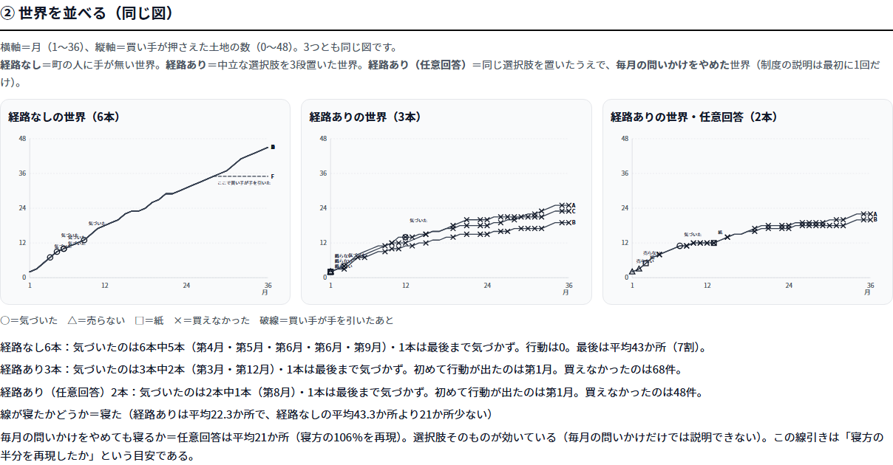

# 静かな占領 ── 見えていても、動く手が無ければ止まらない

**AIの町ひとつで、「気づき」と「行動」を別々に測った。**
48区画・住民26人が全員 言葉のAI。買い手は**台本**（買い手はAIを一度も使わない）。
世界に置いた部品は3つだけ ── **登記簿／買った後に街に残る痕跡／人が集まる場**。
同じ町を2通り走らせ、違いは**中立な選択肢を3段置いたかどうか**だけにした。

*図：横軸＝月（1〜36）、縦軸＝買い手が押さえた土地の数。左＝経路なし6本／中＝経路あり3本／右＝毎月の問いかけをやめた2本。○＝気づいた、×＝買えなかった。*

## 数字（5つ）

1. **7割 → 2割。** 経路なしの世界は最後に街の土地の **68.8%**（平均43か所）が1社の名義。
   選択肢を3段置いた世界は **22.5%**（平均22か所）。〔RESULTS.md 1555・1556〕
2. **買えなかった 68件。** 「今は売らない」と決められていて、台本どおりに買えなかった月。〔同 1557〕
3. **行動は気づきより先に出た。** 最初の「当面売らない」は**3本とも第1月**。
   「同じ買い手だ」と公の場で言えたのは**第3月と第12月（1本は最後まで無し）**。〔同 1558・1559〕
4. **毎月の問いかけをやめても、線は同じだけ寝た（106%）。**
   土地の方針を答えた回数は10分の1以下（582〜544 → 69・46）に落ちたのに結果は変わらない
   ＝効いているのは「思い出させること」ではなく**選択肢そのもの**。〔同 1639・1645〕
5. **役場の「条例・届出の検討」は3本とも 0件。** 使われたのは町内会の議題（15・34・16件）と、
   いちばん軽い個人の「当面売らない」（51・54・55件）。**置いてあっても、重い手には手が伸びない。**〔同 1587・1589・1574〕

## 一文の結論

> **町の人に中立な行動の選択肢を3段置くだけで、買い手の線は寝た。
> ただし寝た理由は「同じ買い手だと気づいたから」ではない。**

だから今回の答えは、**「気づかせる仕組み」より先に、普段の「今は売らない」が登記に効く経路を作れ**、になる。
これは条例やチラシを**作る前に**、どの仕組みが効くかを試せる装置である。

## 限界（3行）

- **6本と3本の比較で、無作為化した比較ではない。**傾向であって統計ではない。
- **足したのは選択肢だけでなく束**（宣言が続く／その人の全部の土地にかかる／紙が全員に配られる／買い手が買い直さない）。**どれが効いたかは言えない。**
- **止めることと、見抜くことは別。**経路ありの世界では**気づきがむしろ遅く・弱くなった**（機序は未検証）。

---

*数字の出典は同じフォルダの `numbers_sheet.md`。集計は判定用のAIを1本も使わない決定論（`tools/two_worlds.py`）。公開画面 https://yamachas0.github.io/quiet-acquisition-report/present.html*
