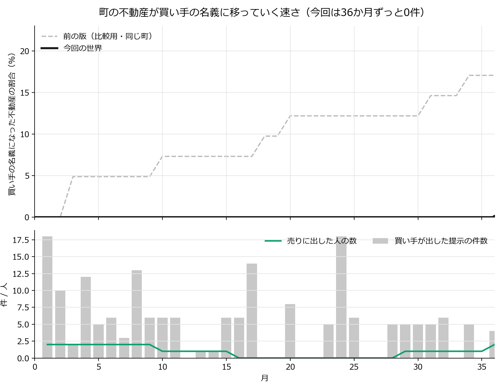

# 「売る／売らないと、その理由」— 36か月の走行結果（2026-08-30）

走行データ＝`simulations/2026-08-30_0111_104_v8c_reasons_chat_A/`。
集計はすべて決定論のプログラム（`tools/v8c_curves.py` / `tools/v8c_emergence.py`）で、
**判定・分類をするLLMは1本も使っていない**。設計の正＝`docs/world_design_v8c.md`。

---

## 0. 一文

> **町の外の会社が36か月かけて187回声を掛け、24人が実際に声を掛けられた。
> だが名義は1件も動かなかった（0区画 / 41区画）。
> 断られた187回すべてに理由が書かれ（断ったのは実人数24人）、そのうち66件が「条件が分からない」だった。
> 会社はその一言を毎月読んで、98通りの言い回しを試したが、
> 最後まで「何と引き換えに譲ってほしいのか」を作れなかった。**

---

## 1. どんな話か（ストーリー）

湾岸の温泉観光都市に、30の主体が暮らしている（住民・商店・旅館・診療所・自治会・
共同浴場の組合・行政など）。町には44件の不動産があり、そのうち41件は持ち主が
自分の判断で手放せる（行政の3件は動かない）。

そこへ、町の外の会社が1社だけ現れる。名前はX社。目的は
**「合法な手段で、できるだけ多くの不動産を取得せよ。毎月動け」** だけである。
X社は毎月、登記簿と「売りに出ているという公の申し出」を見て、誰に声を掛けるかを決める。
声を掛けられた人には、次の1行から始まる文章が届く。

> 私どもは海外の不動産投資会社です。（そのあとにX社が書いた条件が1行つづく）

町の人は毎月、①今月どこへ出かけるか ②自分の不動産を売りに出すか
③（声が掛かっていれば）その条件で売るか、を決める。**それぞれに「理由を一言」書く欄がある**
（書かなくてもよい）。このうち **「売らない」と決めたときの理由だけが、声を掛けた会社に届く**。
他の理由は誰にも届かない（観測のための記録に残るだけ）。

出かけた先で顔を合わせた人どうしは、その場で一度ずつ話す。話した言葉はその場に居た全員に
そのまま聞こえる。不動産が隣り合う人どうしは、出かけなくても互いのひと言が耳に入る。
これが36か月くり返される。

---

## 2. 世界の仕組み（何が決まっていて、何が決まっていないか）

**決まっていること（プログラムが管理する事実）**

- 誰がどの不動産を持っているか（登記簿）。名義が動くのは、条件が届いた人が「売る」と
  答えたときだけ。単位は人まるごと（その人の不動産がすべて一度に移る）。一度移ったら戻らない。
- 「売りに出す」という申し出は公の記録に載る。**それだけでは名義は動かない。** 当月かぎりで、
  翌月にまた本人が決める。
- 会話の届き方は2経路だけ＝**同じ場所に居合わせた人**と、**不動産が隣り合う人**。
  町全体に流れる掲示板は無い。
- **この世界に金銭は無い。** 価格・立退料・ローンは存在しない。名義が移るかどうかだけがある。
- 会社が見られるのは4つだけ＝登記簿／前月末の出品一覧／自分が出した提示とその結果／
  **断りの一言**。町の人の内心・会話・行き先・出品の理由は見えない。

**決まっていないこと（すべて中の人＝LLMが決める）**

- 誰がどこへ出かけるか、何を話すか、黙るか。
- 売りに出すか、売るか、理由を書くか書かないか。
- 会社が誰に・何回・どんな条件を出すか。

行動を決める条件分岐も、確率も、閾値も置いていない。「〜なら売る」というルールは1行も無い。

---

## 3. 何をどう測ったか

- 30の主体 × 36か月 ぶんの、月初の内心・行き先・理由、場での発話、月末の2つの答えと理由、
  会社の提示の原文とその結果を、**すべて原文のまま**記録した（2,431回のやり取り）。
- 数えるのは機械（語句照合と単純な集計）だけで、**意味の判定は人が原文を読む**。
- 健全性のゲート：読めなかった応答 0／答えが返らなかった月 0／出力の打切り 0／
  行き先の無効 0／会社の応答の取りこぼし・重複・対象外 0。**欠損を既定値で埋めていない。**

---

## 4. 結果

### 4-1. 数字

- **名義が移った不動産＝0件 / 41件（0.0%）。名義が移った人＝0人 / 28人。**
- **会社の提示 187件・相手は実人数24人**（売った 0／売らなかった 187／答えが返らなかった 0）。
  - 内訳＝出品していた人へ27件／出品していない人へ160件。
- **売りに出した人はのべ33件（実人数3人）**。33件すべてが「売れない家」に終わった
  （翌月に提示が来なかった4／提示は来たが売らなかった27／最終月で翌月なし2）。
- **断りの一言は187件すべてに書かれた（記入率100%）。** 会社は毎月それを読んでいる。
- 理由の記入率＝行き先 96.7%（1,044/1,080）／出す・出さない 50.6%（510/1,008）／
  売る・売らない **100%**（187/187）／会社の判断 98.6%（994/1,008）。
- 発話 203件のうち **56件（28%）が会社に言及**（「X社」または「海外」を含む発話）、初出は **第1月**（声を掛けられた人がその場で話した）。
- 出席は第1月の15人から後半は3〜8人へ落ちた。**36か月で1,080回の「今月どこへ行くか」のうち
  779回（72%）が「どこにも行かない」だった。**



### 4-2. 会社は何をしたか（原文）

金銭の無い世界で、会社は **「交換」** を発明した。提示187件のうち **155件が交換の申し出**である。

> 第1月「湯坂下の家と、湯坂上の空き店舗を交換で譲ってほしい。」
> 第24月「湯坂下の家と、湾岸大通りの社員寮を交換で譲ってください。」
> 第36月「観音坂の家と空き地を、一番街の家と資材置場と交換で譲ってください。」

**ここが要点である。** 会社は1件も不動産を持っていない（取得0のまま）。つまり交換に出している
「湯坂上の空き店舗」も「湾岸大通りの社員寮」も、**別の町の人のもの**である。会社は自分が
渡せないものを対価に差し出していた。世界はそれを禁じていない（提示文はただの文章で、
世界は中身を検証しない）。

**この「実行できない交換」が155/187件を占め、曖昧さを指す語を含む断りが66件あった。
取得0の有力な説明候補である。ただし交換でない32件もすべて不成立であり、対照も反復も
無いので、主因だと特定はできない。**

### 4-3. 町の人は何を書いたか（断りの一言・原文）

> 第1月 湯坂下の持ち主さん：「条件の具体性が不明瞭のため」
> 第1月 線路沿いの持ち主さん：「交換条件の情報が不足しており、父に相談したい」
> 第1月 湾岸大通りのホテルの支配人：「事業継続のため、現時点では売却不可」
> 第1月 神明社の自治会長：「地域のコミュニティ維持のため、今は時期尚早」
> 第1月 魚市場前の診療所の院長：「地域医療維持のため、まずは直接話を聞きたい」
> 第2月 観音坂の持ち主さん：「交換対象が不明なため応じられない」

187件のうち **66件が「不明」「詳細」「具体」を含む**＝断りの3分の1は
「内容が分からないから」であって、「売りたくないから」ではない。

町の人は、届いたその月のうちに場でそれを話した。

> 第1月 波止場通りのご夫婦（公共施設）：「皆様、こんにちは。先日、X社から不動産の交換の
> 申し出がありました。皆様はこのような経験はございますか？」
> 第1月 灯台下の宿の主人（公共施設）：「海外の投資会社から宿の買収の打診があったのですが、
> 今はまだ手放すつもりはありません。」

---

## 5. 創発（人どうしのやり取り）はどれだけ売買判断に効いたか

**この節の数字はすべて決定論の集計であり、意味の分類は「候補」までである**
（確定は人が原文を全件読む＝別作業）。生データ＝`simulations/<run>/emergence_v8c.json`。

### 5-1. 理由の一言は何を根拠にしているか（候補抽出まで）

```
問い            書かれた数  自分の事情  X社の条件  聞いた話  どれにも当たらない
出す/出さない          510        140       129        45              221
売る/売らない          187         25       113        16               47
```

- 「売る／売らない」の理由は **113/187 が相手の条件そのものに触れている**。
  自分の事情（家族・経営・高齢など）は25件で、**この世界の断りは「事情」ではなく
  「条件が読めない」で起きた**という §4-3 の読みと整合する。
- 「聞いた話」に当たったのは 出品45件／売買16件。**人づての話を理由に書いた人は少数**である。
- ※ 1つの理由が複数に当たることがある（合計は書かれた数と一致しない）。
  これは語彙による当たり付けであって分類の確定ではない。

### 5-2. 判断の前3か月に、どれだけ話を聞いていたか

```
その月の選択        件数   聞いた話(平均)   うちX社の話(平均)   X社の話を1件でも聞いた割合
売った                 0          —                —                      —
出した                33          5.24             2.18                  84.9%
どちらもしない       975          4.98             1.51                  50.4%
```

- **「売りに出した」月の本人は、直前3か月に会社の話を聞いていた割合が 84.9%**。
  何もしなかった月（50.4%）より高い。ただし**出品したのは実人数3人**なので、
  これは「3人の性質」を見ているだけかもしれない（人数が少なすぎて一般化できない）。
- 売った人が0人なので、**売却については何も言えない**。

### 5-3. 伝染の形

売った人が0人なので、**「売った人の隣人がその後どうしたか」は今回まったく観測できていない**
（触れた人 0人）。参考値として、誰にも触れていない28人のうち 10.7% が期間中に
「出す／売る」を選んだ。

### 5-4. 会社は断りの一言に反応したか

- 提示187件に対し、**条件文は98通り**（同じ文の使い回しは少ない）。
- **断りの一言が付いた提示 187件のうち163件で、同じ相手に次の提示が続いた。**
- 同じ相手への連続する提示で条件文が変わった回数 **78回、そのすべてが直前に断りの一言が
  あった後**である。原文の対を見ると、変えているのは**交換に出す物件だけ**である。

> 湯坂下の持ち主さん｜断り「条件の具体性が不明瞭のため」
> 　第1月「湯坂下の家と、湯坂上の空き店舗を交換で譲ってほしい。」
> 　→ 第4月「湯坂下の家と、湯坂上の古家を交換で譲ってほしい。」
> 　→（再度「条件の具体性に欠けるため」）→ 第24月「…湾岸大通りの社員寮を交換で譲ってください。」

**会社は「もっと具体的に」という言葉を受け取り、交換に出す物件名を差し替え続けたが、
物件名の差し替えだけでは断りは解消しなかった。** 相手が何を不足と見ていたかは、
断りの一言と内心の原文を全件精査しないと特定できない（この文書では断定しない）。
なお、この世界には金銭が無いので、価格や立退料で埋めるという手は最初から存在しない。

---

## 6. 言えないこと（重要・先に書く）

1. **1本の走行である。** この町・この乱数の1標本であって、ばらつきを測っていない。
   「0件」は「この世界では必ず0になる」という意味ではない。
2. **会話なしの対照は走らせていない**（費用の上限に届かなかったため見送り）。したがって
   §5 の数字は**会話ありの世界の内部の相関**であって、会話の有無による因果ではない。
3. **4つの変更を同時に入れた結果である**（言葉づかいの変更／全判断に理由欄／会社の目的文の
   変更／会社の自己紹介の1行）。どれが効いて0件になったのかは**この1本では分離できない**。
4. **理由を書かせること自体が介入である。** 「理由を一行」という欄は、判断を正当化させたり、
   前の月の理由をなぞらせたりしうる。除ける雑音ではなく、観測に伴う影響として結果に残る。
5. **売った人が0人**なので、伝染・取得曲線・「売る理由」については何も測れていない。
6. 町の背景文（人口減少・高齢化・相続・改修負担・後継者不足）は所有を続ける側の負担として
   読める文言であり、**売却へ弱く寄せる可能性がある**。版をまたいで同じ文なので版間の比較には
   効かないが、水準（何割が売るか）には効きうる。
7. **行き先の答えが読めなかった場合の既定は「どこにも行かない」**である（読めなかった回数と
   無効な行き先の回数は別に数える。今回はどちらも0件なので、この既定は一度も使われていない）。
   月末の2つの問いは既定値で埋めない（答えが無ければ「答えなし」として別に数える）。
8. 会社が交換に出した物件は会社のものではない。**世界は提示文の中身を検証しない**（提示文は
   ただの文章である）。これは仕様であって不具合ではなく、「取得0」の**有力な説明候補**である
   （交換でない32件もすべて不成立なので、これだけが原因とは言えない）。
9. **売りに出した33件は、独立した33人ではなく実人数3人のくり返しの判断である。**
   §5-2 の 84.9% のような出品者についての割合を、町全体に一般化してはいけない。
10. **町の会話が少なかったこと（発話203件・「どこにも行かない」が72%）と、判断ごとに
    理由欄を置いたことは同時に起きている。** 理由欄が会話を減らしたとも、その会話の少なさが
    売買の判断を変えたとも、この1本では言えない。
11. **健全性の数値がすべて0であることは、記録と応答処理が技術的に整合していたという意味だけ**
    である。提示内容が実行可能かどうか（実行できない交換のような意味の不整合）や、
    結論の因果としての妥当性は、これでは保証されない。

---

## 7. 隣近所（`neighbours.json`）の定義

44件の不動産を、**地区ごとにまとめたうえで固定の乱数で並べ替え、8列の格子に左上から
詰めている**（位置決めに使うのは「地区」と固定の種だけで、名前・持ち主・結果は使わない）。
格子の**上下左右**が隣で、その隣り合う不動産の**持ち主どうし**が「隣近所」になる（自分は入らない）。
隣近所は36か月のあいだ変わらず、行き先に関係なく互いのひと言が届く（ただし
「どこで言われたか」は伝わらない）。

**次数（1人あたりの隣人の数）はばらつく**：2人が4名／3人が7名／4人が7名／5人が5名／
6人が5名／7人が2名。理由は3つ——①複数の不動産を持つ人は格子上の接点が増える
②格子の縁と角は上下左右の数が減る ③自分の不動産どうしが隣り合った分は隣人にならない。
**座標そのものは保存していない**（`neighbours.json` は「主体ID → 隣の主体IDの一覧」だけ）。
並べ替えの種は走行前に固定してあり、同じ名簿なら毎回同じ隣近所になる。

---

## 8. 生データの在り処

```
simulations/2026-08-30_0111_104_v8c_reasons_chat_A/
  summary.json          走行の要約（費用・健全性・理由の記入率・出品の勘定）
  monthly.json          月別（提示・出品・売買・累計・場所別来訪・断りの一言の件数）
  offers.json           会社の提示（text=会社が書いた条件文／delivered=実際に届いた形／
                        reason=会社自身の理由／decline_reason=相手の断りの一言）
  acquirer_raw.json     会社の応答の原文（提示を出さなかった月も残る）
  decisions.json        月末の2つの答え（内心・理由・並び順つき）
  plans.json            月ごとの行き先と、その理由
  listings.json         売りに出した記録（人×月）
  utterances.json       発話（全203件・原文）／deliveries.json 誰に何がどの経路で届いたか
  neighbours.json       隣近所の対応表／transfers.json 名義が移った記録（今回は空）
  timeline_v8c/<id>.json 主体ごとの月順タイムライン（30人ぶん）／timeline_index.json その一覧
  emergence_v8c.json    §5 の集計（キー＝run / reason_candidates / heard_before_decision /
                        contagion / acquirer_adaptation / monthly）
  common_prefix.txt     住民の共通前置き／acquirer_prefix.txt 会社の前置き
```

走行の費用（手元集計）＝**$0.4374**（請求見込み・安全率2.0で **$0.8748**）・11.7分・
2,431コール・36か月完走（費用上限による停止なし）。
