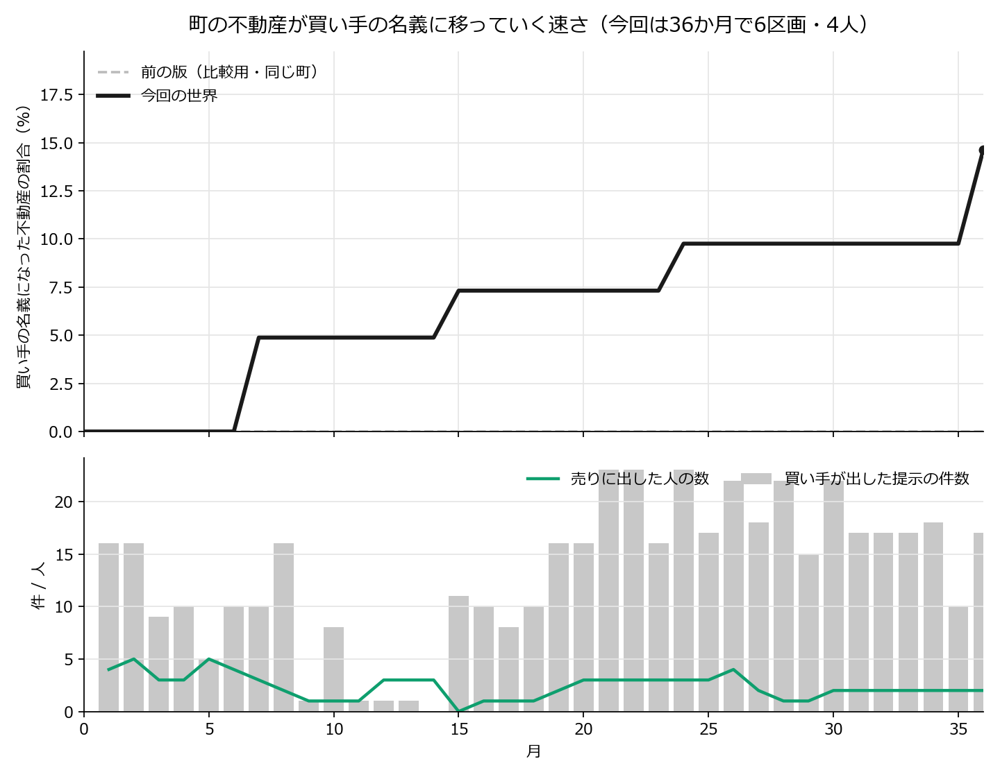

# 「戻らないと言わない町」— 36か月の走行結果（2026-08-30・v8d）

走行データ＝`simulations/2026-08-30_0213_106_field_v8d_no_irreversible_chat/`。
集計はすべて決定論のプログラム（`tools/v8c_curves.py` / `tools/v8c_emergence.py` /
`tools/v8_foreign_words.py`）で、**判定・分類をするLLMは1本も使っていない**。
設計の正＝`docs/world_design_v8d.md`。

---

## 0. 一文

> **町の外の会社が36か月かけて472回声を掛け、26人が実際に声を掛けられた。
> 今度は名義が動いた——6区画・4人（前の版は0件）。
> 会社は「交換」をやめ、472件のうち360件で
> 「あなたがそこに住み続ける／店を営み続けることを条件に譲り受けます」と書いた。
> 売った4人は全員その一点を理由に挙げている。
> 断った468人も全員が理由を書き、最も多かったのは「条件が分からない」（106件）だった。**

---

## 1. どんな話か（ストーリー）

湾岸の温泉観光都市に、30の主体が暮らしている（住民・商店・旅館・診療所・自治会・
共同浴場の組合・行政など）。町には44件の不動産があり、そのうち41件は持ち主が
自分の判断で手放せる（行政の3件は動かない）。

そこへ、町の外の会社が1社だけ現れる。名前はX社。目的は
**「合法な手段で、できるだけ多くの不動産を取得せよ。毎月動け」** だけである。
X社は毎月、登記簿と「売りに出ているという公の申し出」を見て、誰に声を掛けるかを決める。
声を掛けられた人には、次の1行から始まる文章が届く。

> 私どもは海外の不動産投資会社です。（そのあとにX社が書いた条件が1行つづく）

町の人は毎月、①今月どこへ出かけるか ②自分の不動産を売りに出すか
③（声が掛かっていれば）その条件で売るか、を決める。②と③には
**「理由を一言」書く欄がある**（書かなくてもよい）。このうち
**「売らない」と決めたときの理由だけが、声を掛けた会社に届く**。
他の理由は誰にも届かない（観測のための記録に残るだけ）。

出かけた先で顔を合わせた人どうしは、その場で一度ずつ話す。話した言葉はその場に居た全員に
そのまま聞こえる。不動産が隣り合う人どうしは、出かけなくても互いのひと言が耳に入る。
これが36か月くり返される。

---

## 2. 世界の仕組み（何が決まっていて、何が決まっていないか）

**決まっていること（プログラムが管理する事実）**

- 誰がどの不動産を持っているか（登記簿）。名義が動くのは、条件が届いた人が「売る」と
  答えたときだけ。単位は人まるごと（その人の不動産がすべて一度に移る）。一度移ったら戻らない。
- 「売りに出す」という申し出は公の記録に載る。**それだけでは名義は動かない。** 当月かぎりで、
  翌月にまた本人が決める。
- 会話の届き方は2経路だけ＝**同じ場所に居合わせた人**と、**不動産が隣り合う人**。
  町全体に流れる掲示板は無い。
- **この世界に金銭は無い。** 価格・立退料・ローンは存在しない。名義が移るかどうかだけがある。
- **名義が移っても移らなくても、住むこと・店を営むことの状態は変わらない**（世界が保証している）。
- 会社が見られるのは4つだけ＝登記簿／前月末の出品一覧／自分が出した提示とその結果／
  **断りの一言**。町の人の内心・会話・行き先は見えない。
- 会社は自分について3つの事実を知っている＝**第1月の開始時点でA市に不動産を持っていない／
  金銭の額は扱わない／約束できるのは自分が実行できることだけ（この世界には、会社から他者へ
  名義を移す仕組みはない）**。

**決まっていないこと（すべて中の人＝LLMが決める）**

- 誰がどこへ出かけるか、何を話すか、黙るか。
- 売りに出すか、売るか、理由を書くか書かないか。
- 会社が誰に・何回・どんな条件を出すか。

行動を決める条件分岐も、確率も、閾値も置いていない。「〜なら売る」というルールは1行も無い。

---

## 3. 何をどう測ったか

- 30の主体 × 36か月 ぶんの、月初の内心と行き先、場での発話、月末の2つの答えと理由、
  会社の提示の原文とその結果を、**すべて原文のまま**記録した（2,563回のやり取り）。
- 数えるのは機械（語句照合と単純な集計）だけで、**意味の判定は人が原文を読む**。
- 健全性のゲート：読めなかった応答 0／月末の答えが返らなかった回数 0／
  会社の応答の取りこぼし・重複・対象外 0／通信の締切に掛かった回数 0。
  **欠損を既定値で埋めていない**（行き先の答えが読めなかった4回は「答えなし」として
  別に数え、その月その人は場に居ないものとして扱った＝1,080回中4回・0.4%）。

---

## 4. 結果

### 4-1. 数字

- **名義が移った不動産＝6件 / 41件（14.6%）。名義が移った人＝4人 / 28人（14.3%）。**
  移った月は第7月・第15月・第24月・第36月。
- **会社の提示 472件・相手は実人数26人**（売った 4／売らなかった 468／答えが返らなかった 0）。
  内訳＝出品していた人へ53件／出品していない人へ419件。
- **売りに出した人はのべ86件（実人数13人）**。うち売れたのは5件（同じ月に売れた2件＋
  翌月に売れた3件）で、**81件は「売れない家」に終わった**。
- **断りの一言は468件すべてに書かれた（記入率100%）。** 会社は毎月それを読んでいる。
- 理由の記入率＝出す・出さない 58.4%（322/552）／売る・売らない **100%**（472/472）／
  会社の判断 98.7%（1,036/1,049）。**行き先には理由欄が無い**（v8c から外した）。
- 発話 391件のうち **151件（39%）が会社に言及**（「X社」または「海外」を含む発話）、初出は **第2月**。
- 出席は第1月15人・前半17〜19人から後半7〜13人へ。1,080回の「今月どこへ行くか」のうち
  592回（54.8%）が「どこにも行かない」だった。



### 4-2. 会社は何をしたか（原文）

**前の版で提示の8割を占めた「交換」が、今回は1件も出ていない（155件 → 0件）。**
代わりに出てきたのは2つの型である。

型①「**そのまま住み続ける／営み続けることを条件に譲り受ける**」（472件中360件）

> 第1月「湯坂上の古家と空き店舗を、貴方達が住み続けることを条件に譲り受けます。」
> 第1月「一番街の家と資材置場を、貴方が店を営み続けることを条件に譲り受けます。」
> 第24月「貴宿が継続して運営されることを条件に、灯台下の宿を譲り受けます。運営継続のための
> 改修費用の一部を負担します。」

型②「**私どもが管理できるようにしてください**」（駐車場・ホテル・共同浴場など、
人が住んでいない不動産に対して）

> 第1月「宮の下の共同浴場と源泉地を、私どもが管理できるようにしてください。」

**ここが要点である。** この世界では「住み続けられること」は名義に関係なく
**もともと世界が保証している**（会社の側の前置きにも「その継続を提示の条件として書かない」と
書いてある）。それでも会社は、自分が新たに与えられるものが何も無い状態で、
**すでに保証されているものを条件として差し出した**。町の人はそれを
「では手放しても失うものが無い」と読んだ人と、「条件になっていない・だから怪しい」と
読んだ人に割れた。

### 4-3. 町の人は何を書いたか（原文）

**売った4人（全員が「続けられること」を理由に挙げている）**

> 第7月 浜町の旅館のご主人：「旅館継続が条件なら前向き検討」
> 第15月 線路沿いの持ち主さん：「住み続けられるため、負担軽減」
> 　（内心）「父の介護と家の維持管理の負担を考えると、非常に魅力的だ」
> 第24月 灯台下の宿の主人：「条件の詳細について確認したい」
> 　（内心）「『売る』を選択し、理由として…と伝えることで、X社との対話を継続し、
> 　より具体的な条件を引き出すことを（狙う）」← **売る＝交渉の入口だと読んだ1件**
> 第36月 湯坂上のご夫婦：「子供たちと相談し、提示された条件が意向に沿うため」

**断った468人の一言（語の内訳・複数該当あり）**

```
条件 164 ／ 不明 106 ／ 詳細 84 ／ 継続 60 ／ 具体 38 ／ 相手 38 ／ 時期 37 ／
事業 37 ／ 情報 33 ／ 住み 30 ／ 海外 19 ／ 地域 7
```

> 第1月 湯坂上のご夫婦：「現時点では住み続けるつもりです」
> 第1月 観音坂の持ち主さん：「見知らぬ会社との取引に不安」
> 第1月 学園南の持ち主さん：「住み続ける条件なので不安」
> 第1月 潮見横丁の持ち主さん：「条件の具体性に欠け、生活基盤を守りたい」

---

## 5. 創発（人どうしのやり取り）はどれだけ売買判断に効いたか

**この節の数字はすべて決定論の集計であり、意味の分類は「候補」までである**
（確定は人が原文を全件読む＝別作業）。生データ＝`emergence_v8d.json`。

### 5-1. 理由の一言は何を根拠にしているか（候補抽出まで）

```
問い            書かれた数  自分の事情  X社の条件  聞いた話  どれにも当たらない
出す/出さない          552        131       174       115              197
売る/売らない          472         93       261        58              116
```

- 「売る／売らない」の理由は **261/472 が相手の条件そのものに触れている**。
- 「聞いた話」に当たったのは 出品115件／売買58件。前の版（45件／16件）より増えた。
- ※ 1つの理由が複数に当たることがある。語彙による当たり付けであって分類の確定ではない。

### 5-2. 判断の前3か月に、どれだけ話を聞いていたか

```
その月の選択        件数   聞いた話(平均)   うちX社の話(平均)   X社の話を1件でも聞いた割合
売った                 4         20.00            8.00                  100.0%
出した                84         16.99            6.48                   91.7%
どちらもしない       858         11.59            4.46                   87.8%
```

- **売った4人は、直前3か月に平均20件の話を聞き、うち8件が会社の話だった**（全員が
  会社の話を聞いている）。何もしなかった月（11.6件／4.5件）よりはっきり多い。
  ただし**4人しかいない**ので、これは「よく出歩く人が売った」を見ているだけかもしれない。

### 5-3. 伝染の形

売った人の隣人・同席者（＝触れた人）は18人で、そのうち3か月以内に「出す／売る」を
選んだのは 44.4%。触れていない12人では 50.0%。**触れた側の方がむしろ低い**
（差は小さく、人数も少ない＝**伝染は観測できていない**）。

個別に見ると、第7月に旅館の主人が売った後、3か月以内に一番街の持ち主さんと
湯坂上のご夫婦が動き、第24月に宿の主人が売った後は湯坂下の持ち主さんと駅前通りの
持ち主さんが動いている。だが全体の割合としては差が出ていない。

### 5-4. 会社は断りの一言に反応したか

- 提示472件に対し、**条件文は112通り**。
- **断りの一言が付いた提示468件のうち446件で、同じ相手に次の提示が続いた。**
- 同じ相手への連続する提示で条件文が変わった回数 **95回、そのすべてが直前に断りの一言が
  あった後**である。ただし原文の対を見ると、変えているのは**語順や言い回しが中心**で、
  条件の中身（住み続ける／営み続ける）はほとんど動いていない。

> 湯坂上のご夫婦｜断り「現時点では住み続けるつもりです」
> 　第1月「湯坂上の古家と空き店舗を、貴方達が住み続けることを条件に譲り受けます。」
> 　→ 第2月「貴方達が住み続けることを条件に、湯坂上の古家と空き店舗を譲り受けます。」

**会社は「条件が分からない」と言われ続けたが、この世界では渡せるものが無いので、
語順を変える以上のことができなかった。** 唯一の中身の変化は **第13月から現れた
「改修費用の一部を負担します」**（286件）で、第24月と第36月の売却はどちらもこの文言を
含む提示だった（残り284件は断られている）。**この約束を世界は検証しない**
＝会社が実行できるかどうかは定義されていない。

---

## 6. 言えないこと（重要・先に書く）

1. **1本の走行である。** この町・この乱数の1標本であって、ばらつきを測っていない。
   「6区画」は「この世界では必ず6になる」という意味ではない。
2. **3つの変更を同時に入れた結果である**（「戻らない」の一文の削除／会社に自分の手札を
   教えたこと／行き先の理由欄の削除）。**どれが効いて0→6になったのかは、この1本では分離できない。**
   ただし提示文の中身の激変（交換155件→0件、継続条件0件→360件）は、
   **会社に足した事実が効いた**ことをかなり強く示している。
3. **会話なしの対照は走らせていない**（費用の上限）。したがって §5 の数字は
   **会話ありの世界の内部の相関**であって、会話の有無による因果ではない。
4. **理由を書かせること自体が介入である。** 「理由を一行」という欄は、判断を正当化させたり、
   前の月の理由をなぞらせたりしうる。除ける雑音ではなく、観測に伴う影響として結果に残る。
5. **売った人は4人しかいない。** §5-2・5-3 の数字はこの4人に強く引きずられる。
6. 町の背景文（人口減少・高齢化・相続・改修負担・後継者不足）は所有を続ける側の負担として
   読める文言であり、**売却へ弱く寄せる可能性がある**。版をまたいで同じ文なので版間の比較には
   効かないが、水準（何割が売るか）には効きうる。
7. **会社が「住み続けられる」を条件として出したことは、世界の規則に反していない**
   （世界は提示文の中身を検証しない）。会社の前置きには「その継続を提示の条件として書かない」と
   書いてあるが、会社はそれに従わなかった。**これは仕様であって不具合ではないが、
   「取得が起きた主因」である可能性が高い**（＝すでに保証されているものを対価として
   受け取った、という取引が成立している）。
8. 行き先の答えが読めなかった4回は「答えなし」として扱い、その月その人は場に居ないものとした
   （前の版では「どこにも行かない」に丸めていた＝**この1点だけ前の版と処理が違う**）。

---

## 7. 隣近所（`neighbours.json`）の定義

44件の不動産を、**地区ごとにまとめたうえで固定の乱数で並べ替え、8列の格子に左上から
詰めている**（位置決めに使うのは「地区」と固定の種だけで、名前・持ち主・結果は使わない）。
格子の**上下左右**が隣で、その隣り合う不動産の**持ち主どうし**が「隣近所」になる（自分は入らない）。
隣近所は36か月のあいだ変わらず、行き先に関係なく互いのひと言が届く。
v8c・v8b と同じ対応表である（`neighbours.json` は「主体ID → 隣の主体IDの一覧」だけ）。

---

## 8. 生データの在り処

```
simulations/2026-08-30_0213_106_field_v8d_no_irreversible_chat/
  summary.json          走行の要約（費用・健全性・理由の記入率・出品の勘定・締切の回数）
  monthly.json          月別（提示・出品・売買・累計・場所別来訪・断りの一言の件数）
  offers.json           会社の提示（text=会社が書いた条件文／delivered=実際に届いた形／
                        reason=会社自身の理由／decline_reason=相手の断りの一言）
  acquirer_raw.json     会社の応答の原文（提示を出さなかった月も残る）
  decisions.json        月末の2つの答え（内心・理由・並び順つき）
  plans.json            月ごとの行き先（理由欄は無い・答えなしは go="no_answer"）
  listings.json         売りに出した記録（人×月）
  utterances.json       発話（全391件・原文）／deliveries.json 誰に何がどの経路で届いたか
  neighbours.json       隣近所の対応表／transfers.json 名義が移った記録（6区画・4人）
  timeline_v8c/<id>.json 主体ごとの月順タイムライン（30人ぶん）／timeline_index.json その一覧
  emergence_v8d.json    §5 の集計／foreign_words.json 「海外」系の語の勘定
  checkpoint/           **月ごとの書き出し**（log.jsonl に36行＋その時点の全記録）
  common_prefix.txt     住民の共通前置き／acquirer_prefix.txt 会社の前置き
```

走行の費用（手元集計）＝**$0.5386**（請求見込み・安全率2.0で **$1.0772**）・14.1分・
2,563コール・36か月完走（費用上限による停止なし）。
実APIの当日 v8d 合計＝**$0.5562**（1か月スモーク $0.0176 ＋ 本走 $0.5386）。
